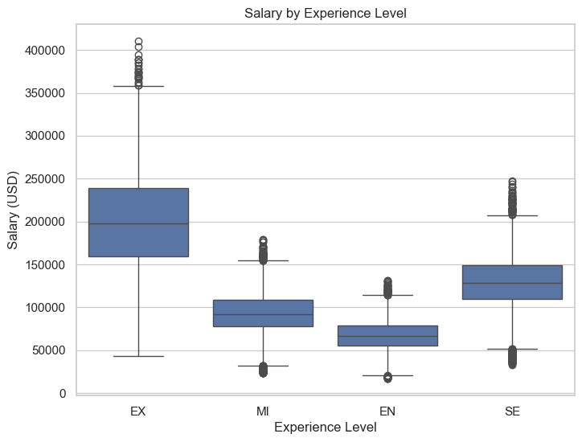
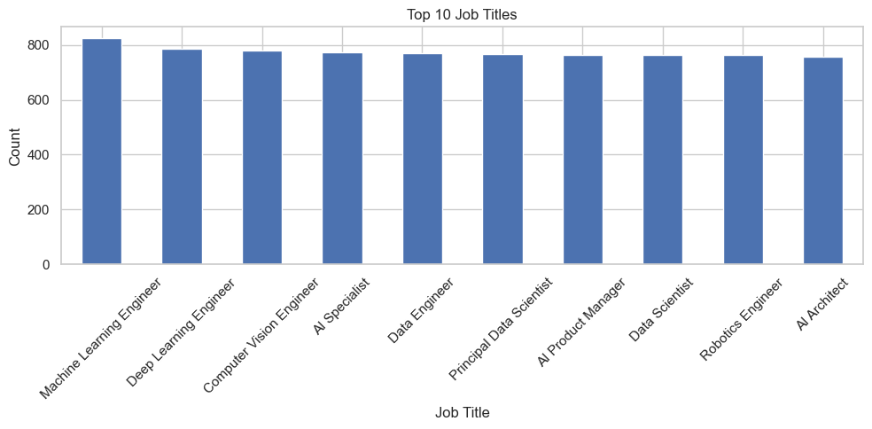

# 🧠 AI Job Market Analysis using EDA

This project explores current trends in AI-related job listings through Exploratory Data Analysis (EDA).  
By analyzing factors like job titles, salary distribution, experience level, company size, and remote flexibility, this study provides insights into the AI job market and hiring landscape.

---

## 📁 Project Structure
```bash
ai-job-market-analysis/
├── data/
│   └── cleaned_data.csv
├── notebooks/
│   └── eda_ai_jobs.ipynb
├── images/
│   └── [All saved plot PNGs]
├── dashboard/
│   └── ai_jobs_dashboard.pbix
├── .gitignore
├── README.md
├── requirements.txt
```

## 🎯 Objective

- Understand the most in-demand AI roles
- Analyze salary distribution by experience and job title
- Explore company-wise and industry-wise hiring patterns
- Investigate the impact of remote work and education requirements

---
## 📊 Dataset Details

- **Source:** [Global AI Job Market and Salary Trends 2025 (Kaggle)](https://www.kaggle.com/datasets/bismasajjad/global-ai-job-market-and-salary-trends-2025)
- **Records:** XXXX rows × XX columns
- **Format:** CSV
- **Features Include:**
  - Job Title
  - Salary (USD and local)
  - Experience Level
  - Employment Type
  - Company Size & Location
  - Remote Ratio
  - Education & Skills Required
  - Industry, Benefits Score, etc.


---

## 🚀 Tools Used

- **Python**
- **Pandas, NumPy** — Data processing
- **Matplotlib, Seaborn** — Visualizations
- **Jupyter Notebook** — Exploratory Data Analysis
- **Power BI** — Interactive Dashboard & Reporting

---


## 📌 Key Insights

- Senior roles offer significantly higher salaries with greater variance.
- Top job titles include Data Scientist, ML Engineer, and AI Researcher.
- Most AI jobs are remote-friendly (50–100% remote ratio).
- Companies in the Technology and Finance sectors are major hirers.
- Higher benefits scores often correlate with larger company sizes.

---

## 📷 Sample Visualizations

  



---

## 📂 How to Run This Project

1. Clone the repository:
   ```bash
   git clone https://github.com/Tauheedjahan/ai-job-market-analysis.git
