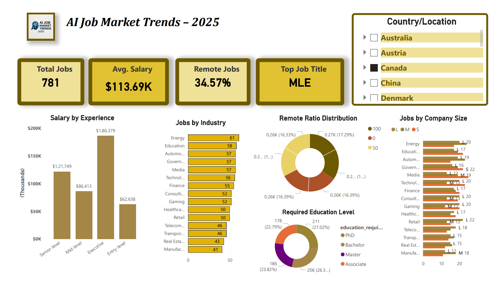

# 🧠 AI Job Market Analysis using EDA
[](LICENSE)

This project explores current trends in AI-related job listings through Exploratory Data Analysis (EDA).  
By analyzing factors like job titles, salary distribution, experience level, company size, and remote flexibility, this study provides insights into the AI job market and hiring landscape.

---

## 📚 Table of Contents

- [Project Structure](#-project-structure)
- [Objective](#-objective)
- [Dataset Details](#-dataset-details)
- [Tools Used](#-tools-used)
- [Key Insights](#-key-insights)
- [Sample Visualizations](#-sample-visualizations)
- [Power BI Dashboard](#-power-bi-dashboard)
- [How to Run This Project](#-how-to-run-this-project)
- [License](#-license)

---

## 📁 Project Structure

```bash
ai-job-market-analysis/
├── data/
│   ├── cleaned_data.csv
│   └── Cleaned_Job_Data_Insights.pbix
│
├── notebooks/
│   └── eda_ai_jobs.ipynb
│
├── images/
│   ├── salary_by_experience.png
│   ├── salary_distribution.png
│   ├── top_10_job_titles.png
│   ├── education_required.png
│   ├── job_openings_by_company_size.png
│   ├── remote_ratio_distribution.png
│   ├── top_10_industries.png
│   ├── job_postings_trend.png
│   ├── correlation_heatmap.png
│   └── dashboard.png
│
├── .gitignore
├── LICENSE
├── README.md
├── requirements.txt
```

## 🎯 Objective

- Understand the most in-demand AI roles
- Analyze salary distribution by experience and job title
- Explore company-wise and industry-wise hiring patterns
- Investigate the impact of remote work and education requirements

---
## 📊 Dataset Details

- **Source:** [Global AI Job Market and Salary Trends 2025 (Kaggle)](https://www.kaggle.com/datasets/bismasajjad/global-ai-job-market-and-salary-trends-2025)
- **Records:** 15001 rows × 20 columns  
- **Format:** CSV
- **Features Include:**
  - Job Title
  - Salary (USD and local)
  - Experience Level
  - Employment Type
  - Company Size & Location
  - Remote Ratio
  - Education & Skills Required
  - Industry, Benefits Score, etc.


---

## 🚀 Tools Used

- **Python**
- **Pandas, NumPy** — Data processing
- **Matplotlib, Seaborn** — Visualizations
- **Jupyter Notebook** — Exploratory Data Analysis
- **Power BI** — Interactive Dashboard & Reporting

---


## 📌 Key Insights

- Senior roles offer significantly higher salaries with greater variance.
- Top job titles include Data Scientist, ML Engineer, and AI Researcher.
- Most AI jobs are remote-friendly (50–100% remote ratio).
- Companies in the Technology and Finance sectors are major hirers.
- Higher benefits scores often correlate with larger company sizes.

---

## 📷 Sample Visualizations


  


---

## 📈 Power BI Dashboard

An interactive Power BI dashboard built using the cleaned job data to visualize AI job trends and insights.

📁 **Location:**
```bash
data/Cleaned_Job_Data_Insights.pbix
```


## 📂 How to Run This Project

1. Clone the repository:
   ```bash
   git clone https://github.com/Tauheedjahan/ai-job-market-analysis.git

---
## 📝 License

This project is licensed under the [MIT License](LICENSE).  
Feel free to use, modify, and share with attribution.
